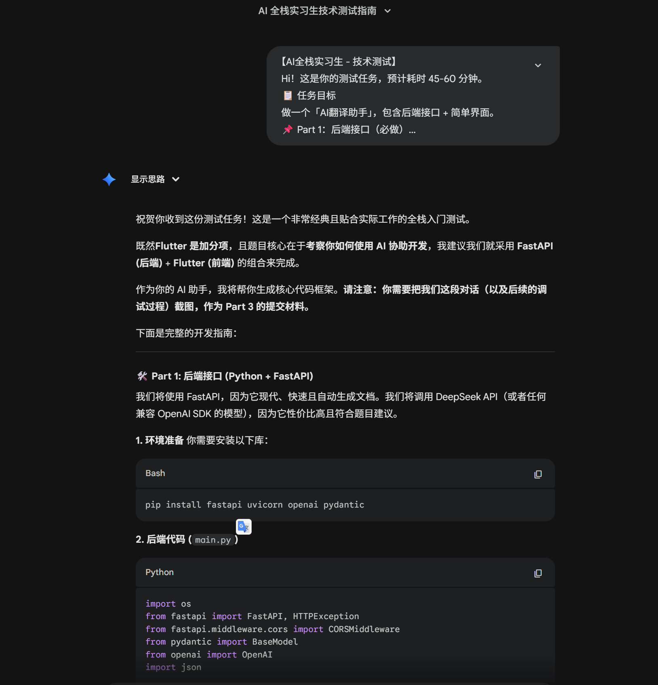
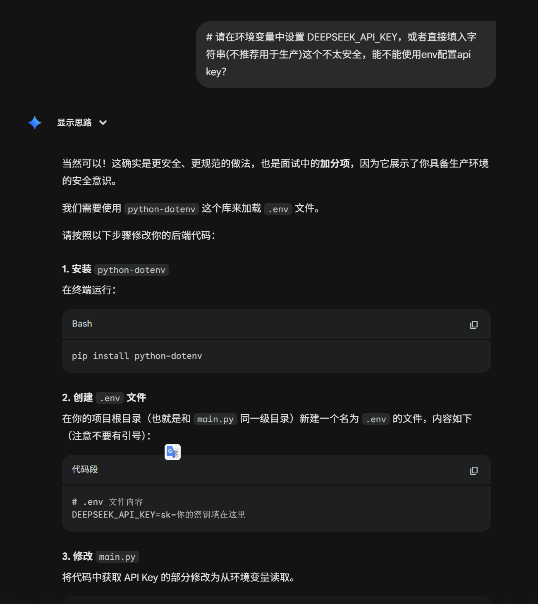
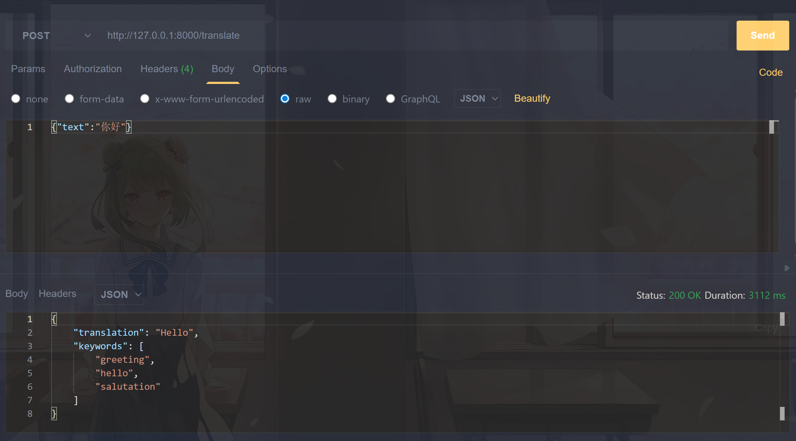
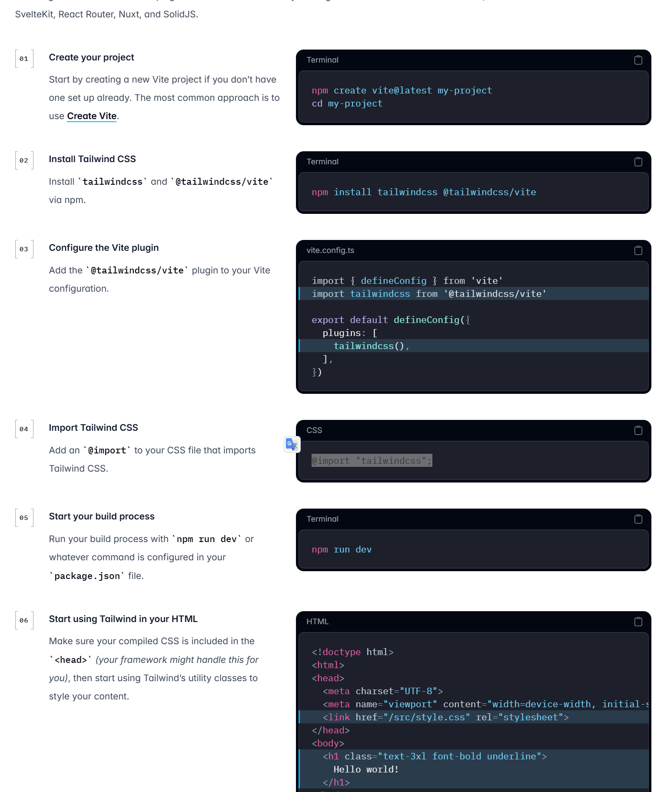
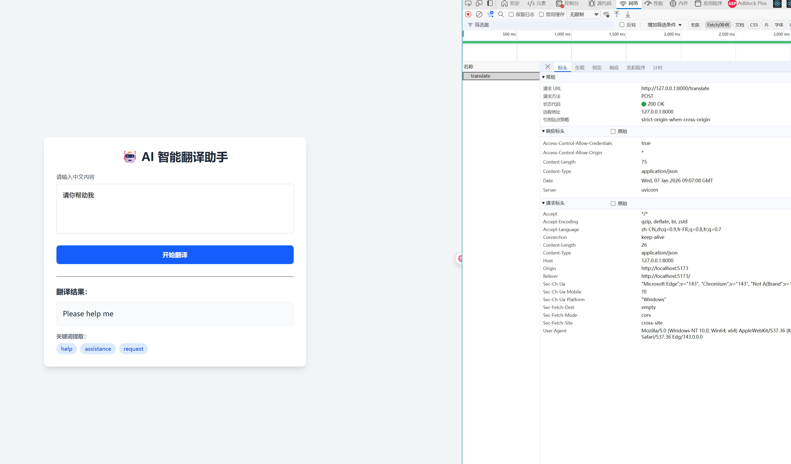

# 发送要求给ai


ai会根据要求列出代码，就是项目的代码，然后将代码复制道我的项目中进行测试，其中ai给出的是deepseek，我的是硅基流动，但是都是openai兼容的接口，所以直接改网址和模型即可

# 修改问题

我读取ai的代码发现ai是把api key硬编码在代码中的，可能会导致apikey泄露，于是我想到可以使用环境变量的方式将apikey提取出来，这样更加安全。


# 再次进行进行api测试

之后进行api测试看看项目是否正常


# 前端项目

前端项目我采用了react+tailwindcss+fetch这个比较快的方式，我给ai描述我的项目技术栈

ai给出的是比较tailwindcss V3的方式，我通过官网参考v4的方式进行安装

之后将代码复制到前端代码里面，然后通过检查前端网页以及浏览器请求确认可以运行


# 运行方式

后端安装

```
pip install fastapi uvicorn openai pydantic python-dotenv
```

需要在项目的根目录新建.env文件，读取apikey

```
API_KEY=xxxxx
```

然后运行

```
uvicorn main:app --reload
```

前端安装

```
因为使用了bun，所以推介下载bun.js
```

然后执行

```
bun install
```

然后运行

```
bun run dev
```

在浏览器打开http://localhost:5173，即可
